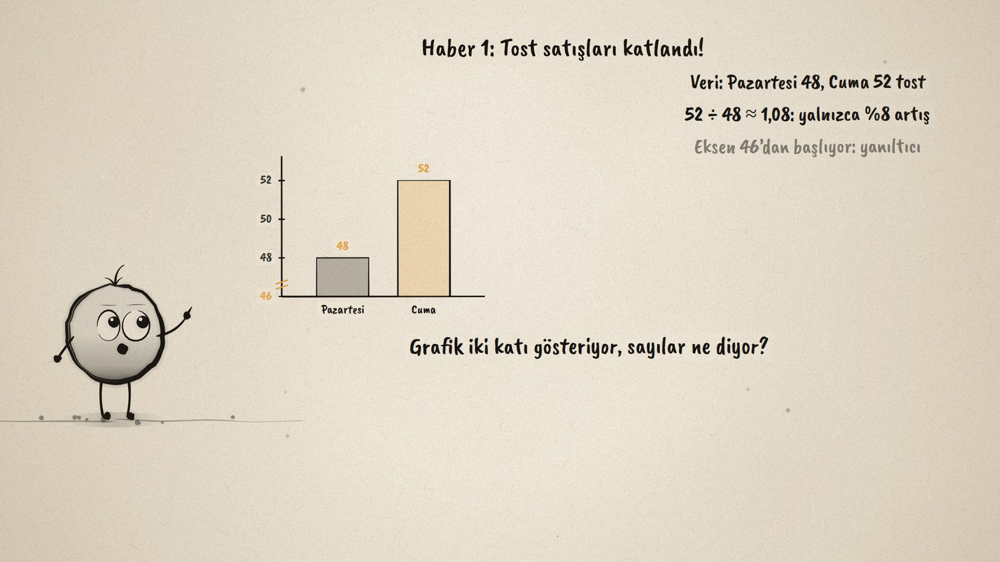
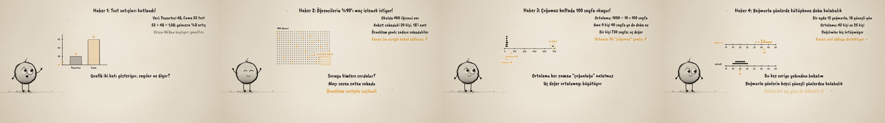

# Haber Doğru mu? · Is the News Right?

**▶ Tarayıcıda izleyin / Watch in the browser:** https://hakanatas.github.io/haber-dogru-mu/ 
**⬇ MP4 + altyazılar / MP4 + subtitles:** [Releases](https://github.com/hakanatas/haber-dogru-mu/releases) 
**✎ Kullanılan istem / The prompt behind it:** [PROMPT.md](PROMPT.md) 
**🎞 Bütün filmler / All films:** [Nokta'nın Filmleri](https://hakanatas.github.io/nokta-filmleri/?sinif=8)

> **TR —** 8. sınıf matematik "İstatistiksel Araştırma Süreci" temasındaki MAT.8.6.2 öğrenme çıktısı için hazırlanmış, tamamen JavaScript ile çizilen 92 saniyelik mürekkep animasyonu. Okul gazetesindeki verilere dayanan dört haber sınanıyor. Tost satışlarının katlandığını gösteren grafiğin ekseni 46’dan başlıyor; sayılar 48 ve 52, yani yalnızca yaklaşık %8 artış: iddia çürütülüyor. Öğrencilerin %90’ının maç izlemek istediği iddiası, 400 öğrencili okulda yalnızca basketbol sahasındaki 20 kişiye sorulan yanlı bir örnekleme dayanıyor: kabul edilemez. Haftada ortalama 100 sayfa okunduğu doğru, ama bir uç değer ortalamayı büyütüyor ve ortanca 30: “çoğumuz 100 sayfa okuyor” yanlış. Son haberde ise yağmurlu ve güneşli günlerin kütüphane verisi hiç örtüşmüyor: iddia kabul ediliyor, tek bir ayın verisi olduğu da not ediliyor. Altyazılar Türkçe, İngilizce ya da ikisi birlikte seçilebilir.

A 92-second ink animation for **8th-grade maths**. Nokta, the ink character from [The Learning Ink](https://github.com/hakanatas/the-learning-ink), is the guide again. Three of the four claims fail for three different reasons (a cut axis, a biased sample, an outlier) and the fourth is accepted, so the film practises judging a claim rather than distrusting every claim.

## Learning outcome

MEB, Türkiye Yüzyılı Maarif Modeli, Ortaokul Matematik, 8th grade, "İstatistiksel Araştırma Süreci" theme:

**MAT.8.6.2. Başkaları tarafından oluşturulan kategorik veya nicel (kesikli-sürekli) veriye dayalı istatistiksel sonuç veya yorumları tartışabilme**
- a) Başkaları tarafından oluşturulan kategorik veya nicel (kesikli-sürekli) veriye dayalı istatistiksel sonuç veya yorumlara yönelik istatistiksel temellendirme yapar.
- b) Başkaları tarafından oluşturulan kategorik veya nicel (kesikli-sürekli) veriye dayalı istatistiksel sonuç veya yorumlara yönelik hataları ya da yanlılıkları tespit eder.
- c) Başkaları tarafından oluşturulan kategorik veya nicel (kesikli-sürekli) veriye dayalı istatistiksel sonuç veya yorumları çürütür ya da kabul eder.

## Scenes

| # | Time | Scene | What happens | Outcome |
|---|---|---|---|---|
| 1 | 0–10 s | Haberler | Four headlines built on data. | a |
| 2 | 10–28 s | Eksen | 48 and 52 look like double because the axis starts at 46: refuted. | a, b, c |
| 3 | 28–46 s | Örneklem | 20 people at the basketball court out of 400: a biased sample. | a, b, c |
| 4 | 46–64 s | Uç değer | A mean of 100 pulled up by one reader; the median is 30. | a, b, c |
| 5 | 64–80 s | Kabul | Rainy and sunny days do not overlap: the claim is accepted. | a, c |
| 6 | 80–92 s | Özet | The axis, the sample, the outlier. | a–c |

## Running it

- **Preview:** double-click `index.html` (it works offline).
- **MP4:** run `npm install` once, then `npm run export -- --format=horizontal --captions=tr`.
- **Subtitles and narration:** `npm run srt` writes `out/captions_*.srt` and `narration_notes.txt`.
- **Editing:**
  - Caption text, timings and narration notes: `captions.js`
  - Everything on screen is drawn by `LI.world(t)` in `scenes/scene1.js` (the headlines, the charts, the dots, the words); the other scenes only set the camera.
  - Nokta's poses: `src/draw/film.js`; layout for 16:9 and 9:16: `src/draw/kd.js`

It uses the same engine as The Learning Ink: `renderFrame(t)` as a pure function of time, seeded randomness, and frame-by-frame export.
